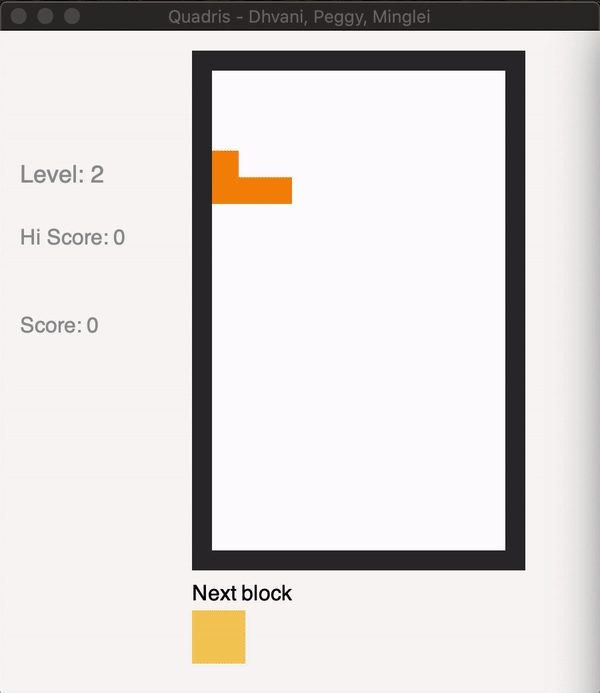

# Quadris Game - Project 3

Members:

- Dhvani Patel
- Peggy Li
- Minglei Li

## Bonus Features/Enhancements:

**1. No Leaks**

All memory management is handled via STL vectors and smart pointers.
- When we run valgrind, we do get some blocks lost, but they are from gtkmm. As per, https://piazza.com/class/k9k9s3zh9jzbi?cid=701, this is fine.

**2. Renaming commands**

Support added for the renaming of existing commands.

**3. GUI**

Programatically created with gtkmm Widgets and DrawingArea.

**4. AI Command (EXTRA)**

`ai` command auto-plays the current level, playing blocks with a calculated optimal placement.

## Command Line Arguments

`./quadris [-text] [-startlevel n] [-scriptfile xxx] [-seed xxx]`

- `-text` runs in text-only mode. Shows both GUI and text by default.
- `-seed` sets the RNG's seed to xxx.
- `-scriptfile` uses xxx instead of sequence.txt as source of blocks for level 0.
- `-startlevel` starts the game at level n.

## Commands

`left`
`right`
`down`
`clockwise`
`counterclockwise`
`drop`
`levelup`
`leveldown`
`norandom file`
`random`
`sequence file`
`restart`
`hint`
`I, J, L, S, Z, O, T`
`exit`
`rename`
`ai`

## Other notes

- level.h was not modularized as it would increase the number of files way too much and each concrete class does not have too much code.
- PImpl was NOT used as it would over abstract the classes that have a lot of data variables. Plus, security is not a critical issue in this application.
- The game is smooth, and if you are experiencing lagg while running over X11, we would recommend running it locally!
- If you want to see a sample GIF of AI mode, check out our Git repo!
  - If you want to inspect the AI, you can add a thread sleep before the AI plays the next hint block.
- Fun Fact: The AI scored a high score of 5067 while running on level 0. This was run by putting the AI mode on a loop.
